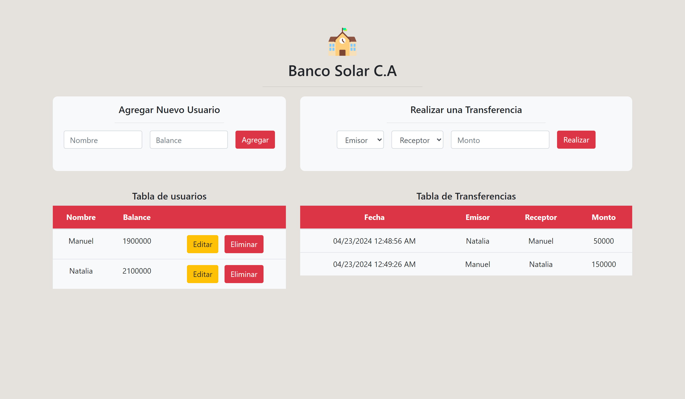
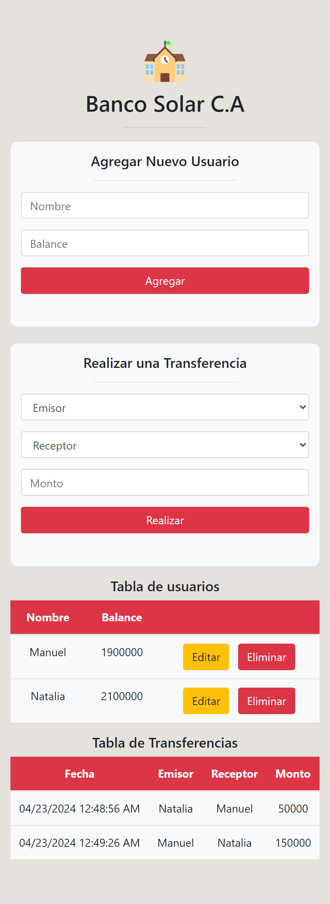

# Prueba - Banco Solar

En esta prueba se validan los siguientes conocimientos:

- Conectar una base de datos PostgreSQL con Node
- Realizar consultas DML con Node y el paquete pg
- Realizar consultas TCL con Node y el paquete pg
- Construir una API RESTful utilizando PostgreSQL para la persistencia de datos
- Manejar errores y Manejar códigos de estado HTTP


## Screenshots





## Rutas Disponibles

- GET: Devuelve la aplicación cliente disponible en el apoyo de la prueba. 
- /usuario POST: Recibe los datos de un nuevo usuario y los almacena en PostgreSQL. 
- /usuarios GET: Devuelve todos los usuarios registrados con sus balances. 
- /usuario PUT: Recibe los datos modificados de un usuario registrado y los actualiza. 
- /usuario DELETE: Recibe el id de un usuario registrado y lo elimina . 
- /transferencia POST: Recibe los datos para realizar una nueva transferencia. Se debe ocupar una transacción SQL en la consulta a la base de datos. 
- /transferencias GET: Devuelve todas las transferencias almacenadas en la base de datos en formato de arreglo

## Dependencias Utilizadas

- express
- pg
- dotenv
- nodemon
- axios

## Instalación y Uso

1. Descarga el repositorio.
2. Instala las dependencias.
3. Crea la siguiente base de datos:

```
CREATE DATABASE bancosolar;
```

```
CREATE TABLE usuarios (id SERIAL PRIMARY KEY, nombre VARCHAR(50), 
balance FLOAT CHECK (balance >= 0)); 
```

```
CREATE TABLE transferencias (id SERIAL PRIMARY KEY, emisor INT, receptor 
INT, monto FLOAT, fecha TIMESTAMP, FOREIGN KEY (emisor) REFERENCES 
usuarios(id), FOREIGN KEY (receptor) REFERENCES usuarios(id));
```

4. Crea un archivo .env en la raíz del proyecto y agrega las siguientes variables de entorno (reemplaza los valores correspondientes):

```
DB_USER = tu_usuario_de_base_de_datos
DB_PASS = contraseña_de_base_de_datos
DB_HOST = host_de_base_de_datos
DB_DATABASE = nombre_de_la_base_de_datos
```
4. Ejecuta el servidor.